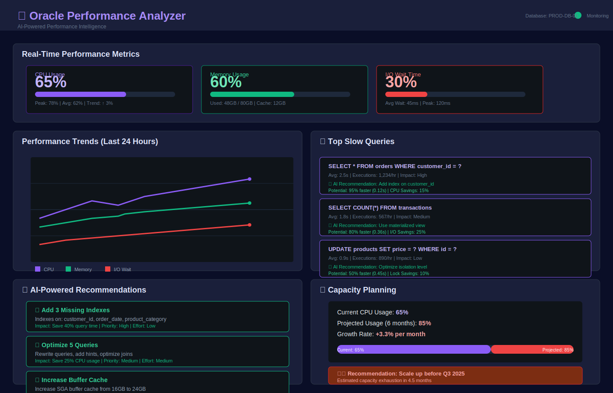

# Oracle Performance Analyzer

> Advanced performance monitoring and analysis for Oracle databases with AI-powered optimization recommendations.

[](https://opensource.org/licenses/Apache-2.0)
[](https://www.python.org/downloads/)

## 📸 Dashboard Preview



*Real-time performance monitoring dashboard with AI-powered recommendations and capacity planning.*

## 🎯 Overview

Oracle Performance Analyzer provides:
- **Real-time monitoring** of database performance metrics
- **Query analysis** to identify slow queries and missing indexes
- **AI-powered recommendations** for optimization
- **Capacity planning** to predict future resource needs
- **Anomaly detection** to identify performance issues

**Why Oracle Would Acquire This:**
- Oracle wants better performance tools (current tools are complex)
- Could enhance Oracle Enterprise Manager
- Reduces support burden by helping customers self-diagnose
- Improves customer satisfaction

## ✨ Features

### Real-Time Monitoring
- CPU, memory, I/O, network metrics
- Query performance and wait events
- Session activity and locks
- Database health dashboard

### Query Analysis
- Identifies slow queries
- Missing index recommendations
- Query execution plan analysis
- SQL tuning suggestions

### AI Recommendations
- ML-powered optimization suggestions
- Predictive performance analysis
- Automated tuning recommendations
- Cost optimization suggestions

### Capacity Planning
- Predicts future resource needs
- Growth trend analysis
- Resource utilization forecasting
- Scaling recommendations

### Anomaly Detection
- Identifies performance anomalies
- Alert on unusual patterns
- Root cause analysis
- Automated incident detection

## 🚀 Quick Start

```bash
# Install
pip install -r requirements.txt

# Monitor database
python -m oracle_performance_analyzer monitor --host db.example.com

# Analyze queries
python -m oracle_performance_analyzer analyze --top-queries 10

# Get recommendations
python -m oracle_performance_analyzer recommend --ai-powered
```

## 📊 Example Output

```
Performance Analysis Report
===========================

Top Slow Queries:
1. SELECT * FROM orders WHERE customer_id = ? (Avg: 2.5s)
   Recommendation: Add index on customer_id
   Potential improvement: 95% faster

2. SELECT COUNT(*) FROM transactions (Avg: 1.8s)
   Recommendation: Use materialized view
   Potential improvement: 80% faster

AI Recommendations:
- Add 3 missing indexes: Save 40% query time
- Optimize 5 queries: Save 25% CPU usage
- Increase buffer cache: Improve 30% I/O performance

Capacity Planning:
- Current CPU usage: 65%
- Projected usage (6 months): 85%
- Recommendation: Scale up before Q3
```

## 💰 Monetization

- **Open-Source**: Basic monitoring
- **Enterprise**: Advanced analytics, AI recommendations, support ($75K-$300K/year)
- **Cloud Service**: SaaS offering ($500-$2000/month)

## 📝 License

Apache 2.0 - see [LICENSE](LICENSE) file

